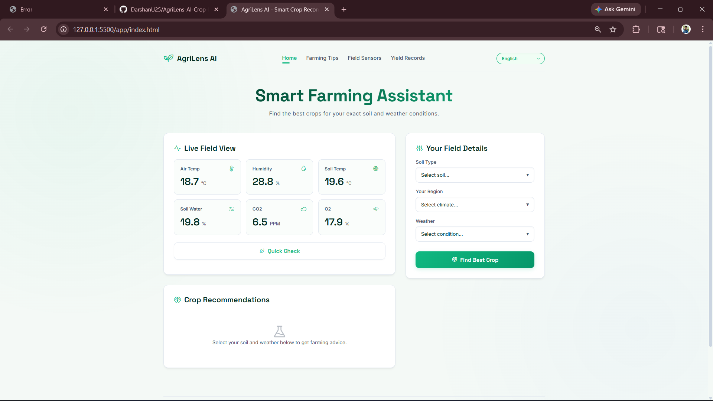
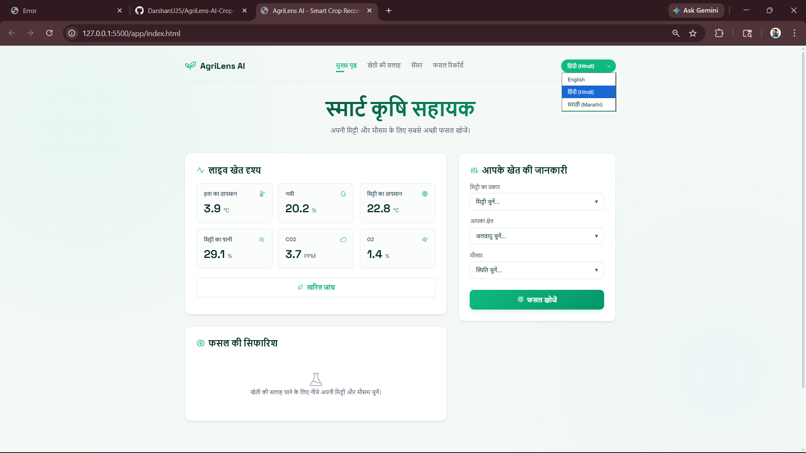
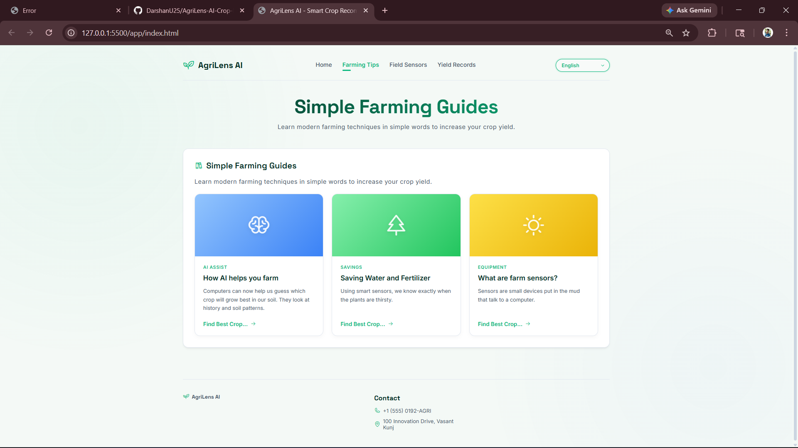

# AgriLens AI - Smart Crop Recommendation System 🌱

AgriLens AI is a state-of-the-art predictive agriculture platform. By analyzing live field telemetry (soil type, region, temperature, humidity) and utilizing backend inference routing, it helps farmers discover the optimal crop for their exact micro-climate, reducing planting failures and maximizing overall yield.

## 🚀 Key Features

*   **Deep Crop Inference:** Receive highly accurate crop recommendations based on localized Soil, Weather, and Geographical data.
*   **Micro-Climate Telemetry:** Live node-monitoring simulations for ambient temperature, subsurface moisture, CO2, and O2 levels.
*   **Multilingual Accessibility:** Custom built-in translation engine instantly switches the interface between **English**, **Hindi (हिंदी)**, and **Marathi (मराठी)**.
*   **"Neo-Nature" Premium UI:** A beautifully designed, fully fluid and responsive glassmorphic frontend layout. Works beautifully on both PC monitors and mobile smartphones.
*   **Fast SPA Routing:** Lightning-fast single-page navigation between Dashboard, Insights, Sensors, and Analytics sections without any page reloads.

## 🛠️ Technology Stack

*   **Backend:** Python, FastAPI, Uvicorn
*   **Frontend:** HTML5, CSS3, Vanilla JavaScript (Zero framework dependencies)
*   **Design Assets:** Phosphor Icons, Google Fonts (Inter & Space Grotesk)

## ⚙️ How to Run the Project Locally

### 1. Prerequisites (CRITICAL)
You **MUST** have Python installed on your computer to run this application! 
If you do not have Python installed, please download and install the latest version from [python.org](https://www.python.org/downloads/).
*(During installation on Windows, ensure you select the checkbox that says **"Add python.exe to PATH"**).*

### 2. Start the Virtual Environment
Open your terminal (Command Prompt or PowerShell) in the root of the project folder and activate your virtual environment:

```bash
# For Windows
venv\Scripts\activate

# For macOS/Linux
source venv/bin/activate
```

*(If you ever need to install the dependencies on a new machine, run: `pip install fastapi uvicorn`)*

### 3. Run the Backend Server
Because the code is cleanly separated, you must first navigate into the `app/` folder before starting the server. Run these commands:

```bash
venv\Scripts\activate
cd app
uvicorn app:app --reload
```
*Wait for the terminal to confirm the server is running, usually at `http://127.0.0.1:8000`.*

### 4. Launch the App!
Simply open the `app/index.html` file in your preferred web browser (Chrome, Edge, Firefox). The frontend will automatically route prediction requests to your locally running backend!

## 📸 Screenshots & How It Works

### 1. The Smart Dashboard


**How it works:** The main dashboard displays live telemetry from your field sensors. When you enter your soil details on the right-hand panel and click "Find Best Crop", the frontend sends a secure request to the local FastAPI Python backend. The backend runs the localized data through the trained predictive machine learning model and instantly returns the best crop yield recommendations alongside AI confidence scores!

### 2. Multi-Language Accessibility


**How it works:** We built a custom vanilla JavaScript translation engine. When a farmer selects Hindi or Marathi from the dropdown, the system instantly loops through the interface and swaps out complex English terminology with localized, farmer-friendly dialects—without ever needing a page refresh.

### 3. Dedicated Articles & Insights


**How it works:** The platform acts as a lightning-fast Single Page Application (SPA). Clicking on the "Farming Tips" navigation link seamlessly hides the dashboard and smoothly animates in the insights view using JavaScript routing logic.

---

### 🌟 Future Roadmap
*   Connect real-time physical IoT hardware nodes to the dashboard arrays.
*   Expand predictive modelling to include real-time satellite weather mapping.
